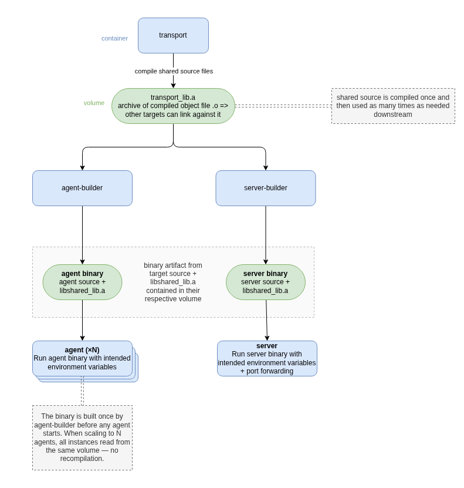

# Inferno

## 📋 Table of Contents

- [Communication protocol](./_docs/project/lptf_binary_protocol.md)
- [Features](#features)
- [Tech Stack](#tech-stack)
- [Dependencies](#dependencies)
- [Quick start](#quick-start)
- [How are agent and server built](#how-are-agent-and-server-built)
- [How to build dashboard](how-to-build-dashboard)
  - [Windows](#dashboard-on-windows)
  - [Linux](#dashboard-on-linux)
--- 

## Project description

Inferno is a distributed remote monitoring and diagnostics platform built in C++.

Originally derived from an academic specification focused on progressively complex networking and system programming challenges, the project has been fully reframed into a legitimate monitoring and orchestration platform.

The project is composed of:

- a central server responsible for orchestration and analysis,
- remote agents deployed on monitored machines,
- and a future Qt desktop dashboard for visualization and control.

The system focuses on:

- low-level network communication,
- custom binary protocol design,
- cross-platform system monitoring,
- and distributed telemetry processing.

## Planned architecture

Inferno is designed as a distributed monitoring system composed of three main components:

### Agent (remote node)

A lightweight system daemon responsible for:

- collecting machine metrics,
- executing diagnostic commands,
- streaming telemetry to the server,
- maintaining persistent connection with automatic reconnection.

### Server (central coordinator)

A central service responsible for:

- managing multiple connected agents,
- receiving and parsing telemetry streams,
- coordinating requests and responses,
- preparing data for visualization and analysis.

### Desktop dashboard (future)

A Qt-based interface providing:

- real-time monitoring dashboard,
- agent management interface,
- visualization of system metrics and diagnostics.

## Features

### Current

- Custom binary communication protocol
- Multi-agent server architecture
- Shared C++ networking library
- Docker-based development pipeline
- Automated test execution during builds
- Multi-agent scaling support via Docker Compose

### Planned

- Continuous metrics streaming
- Remote diagnostics execution
- Cross-platform monitoring agent
- Qt desktop monitoring interface
- PostgreSQL data persistence
- Health analysis and anomaly detection
- Agent reconnection resilience
- Background daemon/service deployment


## Tech Stack

| Layer                  | Technology                                                 |
|------------------------|------------------------------------------------------------|
| Containerization       | Docker & Docker Compose  (Agent & Server build)            |
| Server runtime         | debian:bookworm-20260406-slim                              |
| Server & agent         | C++17 , CMake 3.20 minimum                                 |
| Dashboard              | Qt 6.4.2 minimum, 6.10.2 recommended (Widgets + ?? )       |
| Database               | PostgreSQL                                                 |
| Tests                  | Google Test                                                |
---


## Dependencies

All **server-side and agent-side dependencies** are handled automatically inside the Docker container (using `debian:bookworm-20260406-slim` image) — nothing to install on your machine for the server.

All **dashboard-side dependencies** need to be installed on your host machine (see [How to build dashboard](#how-to-build-dashboard) below).

| Library            | Version            | Where               | Purpose                         |
|--------------------|--------------------|---------------------|---------------------------------|
| Google Test / Mock | system             | All (Docker)        | Unit testing framework          |
| CMake              | CMake 3.20 minimum | Dashboard (host)    | Build system for the Qt client  |
| libssl-dev         | system             | All (Docker & host) | Secure communication on network |


## Prerequisites

- Docker / Docker Desktop or [Podman](https://github.com/containers/podman) installed and running

## Setup

Copy `.env.template` to `.env` and adjust values if needed.

```bash
cp .env.template .env
```

## Quick start

This project uses Docker Compose profiles (`agent` and `server`) to separate build/runtime pipelines and keep logs readable.

`COMPOSE_PROFILES=agent,server` in `.env` allows `docker compose up` and `docker compose down` to work without specifying profiles manually.

### Start all services (agent + server)

```
docker compose up
```

### Start only agents

```
docker compose --profile agent up
```

### Scale agents

```
docker compose --profile agent up --scale agent=N
```

> replace N with the actual number you need

### Start only server

```
docker compose --profile server up
```

### Stop all services

```
docker compose down
```

> add the `-v` flag to remove build volumes and start from scratch

---
## How are agent and server built

This project uses a **multi-stage container build pipeline** orchestrated through Docker Compose-compatible services. The pipeline has been tested with both Docker and Podman.

Builder services are only responsible for compilation and testing.
Runtime services only execute the final binaries produced during the build pipeline.

The first service, `shared`, builds the shared static library (`.a`) inside a dedicated Docker volume.
`shared` tests are executed before the service exits. If any shared test fails, the pipeline stops and dependent services are not started.

The second service (`agent-builder` or `server-builder`) compiles the final target binary using the shared `.a` artifact from the common volume. The compiled target binary is stored in another dedicated volume. Like the `shared` service, target tests are executed before the service exits.

Build artifacts are stored in Docker named volumes (`shared-build`, `server-build`, `agent-build`) so rebuilds can reuse previous outputs. Use `docker compose down -v` to remove these volumes and start from scratch.

Finally, the runtime service starts the compiled target binary directly from its build volume.

Multiple runtime instances can be started without rebuilding the binary, since all instances use the same compiled artifact.

The following diagram illustrates the pipeline:


## How to build dashboard
### Dashboard on Windows

First, check if you already have the required tools:

```bash
qmake6 --version && cmake --version
```

If anything is missing, you have two options:

**Option A — via WSL (Windows Subsystem for Linux):**

```bash
sudo apt install qt6-base-dev qt6-base-dev-tools
sudo apt install cmake
sudo apt install qt6-websockets-dev
```

**Option B — via the Qt official installer:**

Download Qt from [https://www.qt.io/download-open-source](https://www.qt.io/download-open-source) (free community version, account required).
Install `Qt` with `gcc`, `g++` and `cmake` to avoid path issues.
Qt **6.4.2 minimum**, **6.10.2** was used for development.

Then add these to your `PATH`:

```
C:\Qt\Tools\QtCreator\bin
C:\Qt\6.x.x\mingw_64\bin
```

**Build the dashboard:**

From **PowerShell**:
```powershell
./dashboard/windows-build.bat
```

From **Git Bash**:
```bash
powershell.exe -NoProfile -Command "& '$(cygpath -w ./dashboard/windows-build.bat)'"
```

**Run the dashboard:**

```bash
./dashboard/build/dashboard.exe
```
> **WSL:** if you get EGL/MESA errors, add `export LIBGL_ALWAYS_SOFTWARE=1` to your `~/.bashrc`
---

### Dashboard on Linux

Check your tools first:

```bash
qmake6 --version && cmake --version
```

Install if needed:

```bash
sudo apt install qt6-base-dev qt6-base-dev-tools
sudo apt install cmake
sudo apt install qt6-websockets-dev
```

Make the scripts executable (only needed once):

```bash
chmod +x ./dashboard/linux-build.sh
chmod +x ./dashboard/run.sh
```

Build then run:

```bash
./dashboard/linux-build.sh
./dashboard/run.sh
```

**WSL only:** if you get EGL/MESA rendering errors, add this to your `~/.bashrc` and restart your terminal:
```bash
export LIBGL_ALWAYS_SOFTWARE=1
```
> WSL has no GPU access, so Qt's hardware OpenGL rendering fails. This flag forces software rendering instead.

---
